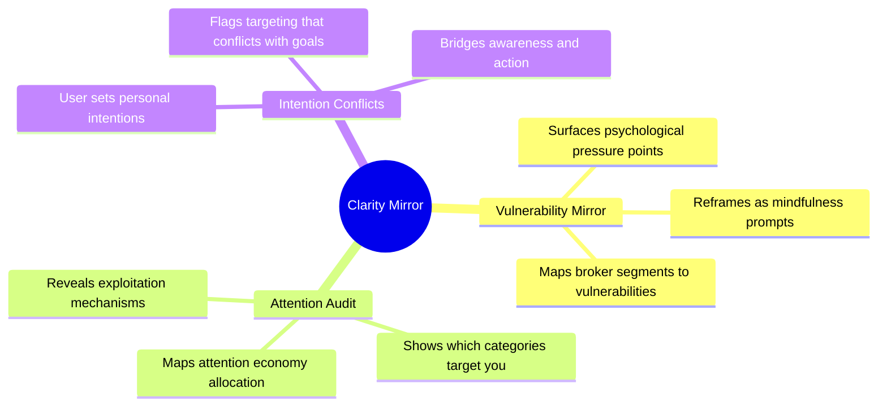
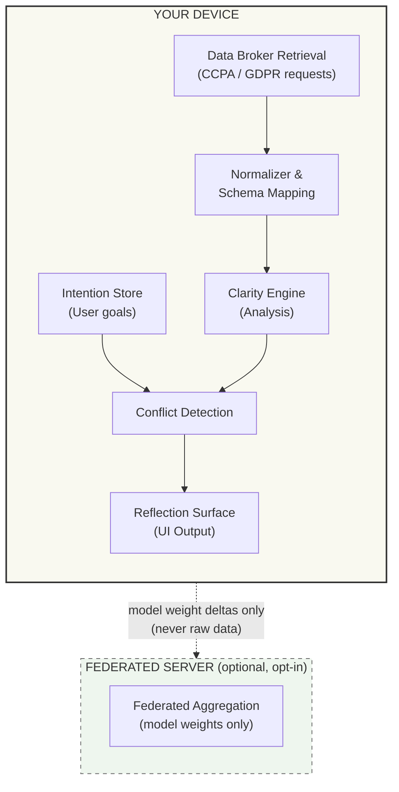
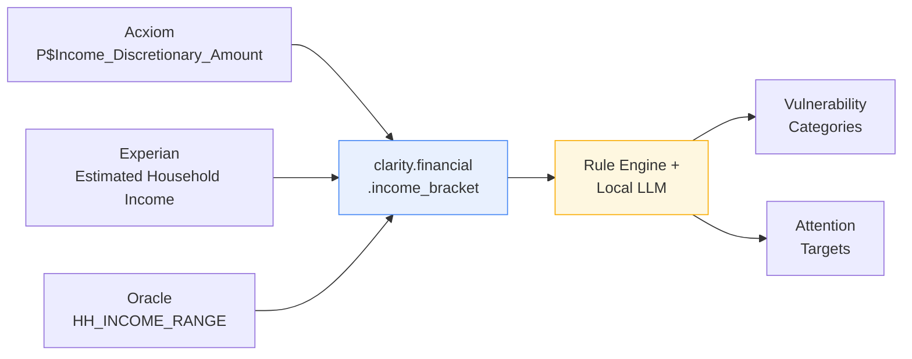
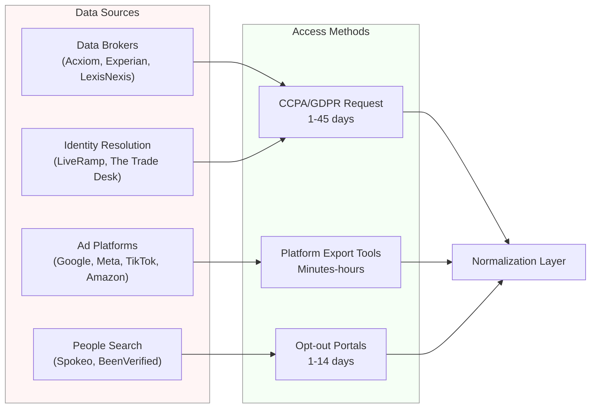
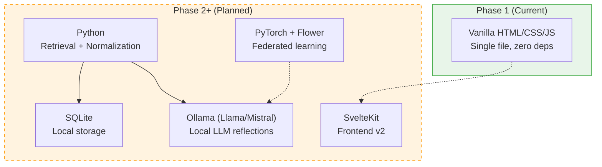
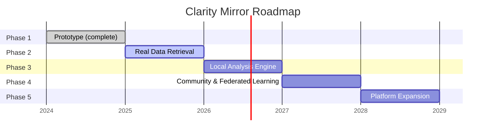
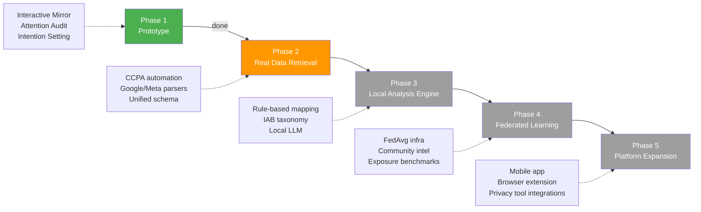
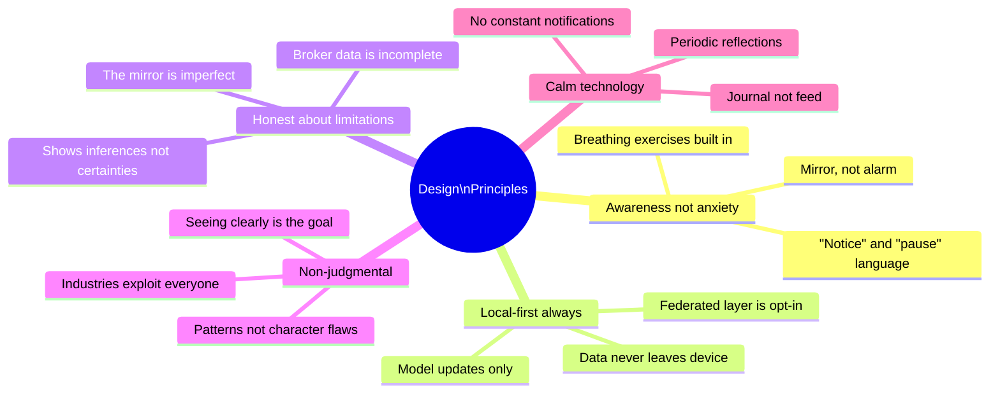

# Clarity Mirror — Project Summary

## Table of Contents

- [Overview](#overview)
- [Core Features](#core-features)
- [System Architecture](#system-architecture)
- [Data Normalization Flow](#data-normalization-flow)
- [Data Retrieval Sources](#data-retrieval-sources)
- [Tech Stack](#tech-stack)
- [Roadmap](#roadmap)
- [Design Principles](#design-principles)

---

## Overview

**Clarity Mirror** is a privacy-first tool that shows people what data brokers know about them and how advertisers exploit that data. It reframes surveillance profiles as prompts for self-awareness — turning "what they know about you" into "what you can notice about yourself."

All analysis runs locally. Raw data never leaves the device.

## Core Features

## System Architecture

## Data Normalization Flow

## Data Retrieval Sources

## Tech Stack

## Roadmap

### Phase Details

## Design Principles

