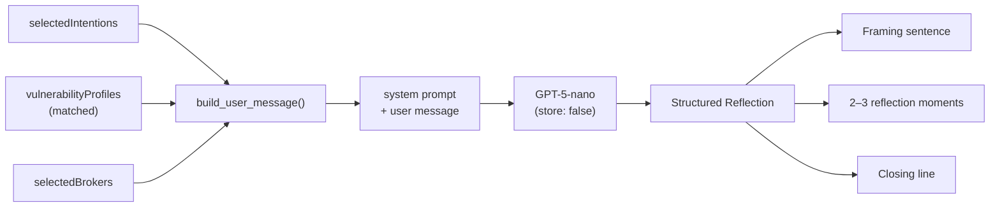
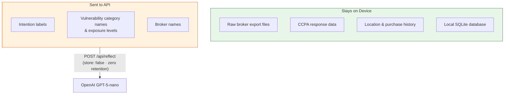
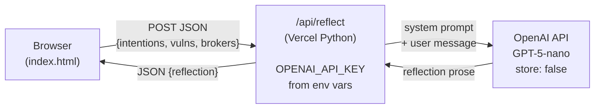

# LLM Integration — Clarity Mirror

> **Model:** OpenAI GPT-5-nano · **SDK:** `openai` (Python) · **Privacy:** `store: false` (zero retention)

## Why we're doing this

The reflection panel is currently the weakest part of the product. It shows the same three hardcoded sentences to every user, regardless of what intentions they selected, which brokers they chose, or what vulnerabilities surfaced. A user who selects "Protect my focus" and a user who selects "Spend more mindfully" see identical text.

LLM integration replaces that with a reflection that is actually responsive to the user's specific profile — their stated intentions, their matched vulnerability categories, and their broker footprint. This is the feature that makes the product feel like a mirror rather than a pamphlet.

It also unlocks the persona system: each persona produces a distinct vulnerability signature and broker context, and the LLM generates a reflection tailored to that specific combination rather than one the team had to pre-write.

---

## What gets sent to the model

The LLM receives three inputs assembled at generation time:

**1. The user's stated intentions**
Everything in `selectedIntentions` plus any custom intention text. Example:
```
"Spend more mindfully", "Protect my focus", "I want to stop comparing myself to people online"
```

**2. The matched vulnerability profiles**
The categories, exposure levels, and broker-voice descriptions for the profiles that matched the user's broker selection. Example:
```
- Financial Anxiety (high): "Credit-monitoring behavior pattern. Classified as financially anxious, responsive to urgency-based financial products."
- Attention Fragmentation (medium): "Multi-platform engagement, high scroll velocity. Attention span profiled as snackable content optimized."
```

**3. The selected brokers**
Which data sources are in the profile. This provides context about the type of data involved.

These inputs are assembled into a user message. The system prompt (see `docs/SYSTEM-PROMPT-BRIEF.md`) governs how the model responds to them.



---

## What the model returns

A structured reflection containing:

- **A framing sentence** — one sentence that acknowledges the specific tension between the user's intentions and their vulnerability profile
- **2–3 reflection moments** — short paragraphs, each grounding an abstract insight in a specific, recognizable situation the user might encounter
- **A closing line** — a single quiet sentence that returns the user to agency

The model should not return lists, headers, or markdown formatting. The output is prose, rendered directly into the existing reflection panel UI.

---

## Privacy considerations

Sending data to a hosted API means intention data leaves the device. This is a deliberate, limited exception to the local-first principle:

- **What is sent:** Self-reported intentions and vulnerability category labels. No raw broker data, no personal identifiers, no behavioral records.
- **What is not sent:** Actual broker export files, CCPA response data, location data, purchase history, or anything from the local SQLite database.
- **API configuration:** Use zero data retention mode where available (OpenAI supports this via `store: false` parameter). Confirm this is configured before shipping.
- **User disclosure:** The UI must tell the user before they generate that reflection generation uses an AI model and what is sent. This should be a one-time acknowledgment, not a modal on every generation.

Update `PRIVACY-MODEL.md` to document this exception explicitly once the integration is live.



---

## Implementation

### Where it plugs in

In `index.html`, the reflection panel is rendered in `renderResults()`. The function accepts the LLM reflection as a parameter:

```javascript
function renderResults(vulns, allIntentions, reflectionResult) {
  // If reflectionResult is non-null, render LLM prose into #reflection-text and #reflection-moments
  // If null (API failed), fall back to the original hardcoded reflection
}
```

The `generateMirror()` function is async and fires the API call via `generateReflection()` in parallel with a minimum loading delay using `Promise.all`.

### Architecture

The API key must never be in the frontend. The call goes through a thin backend endpoint:

```
Browser (index.html)
    │
    ▼
/api/reflect  (Vercel serverless function — Python)
    │  Assembles system prompt + user message
    │  Calls OpenAI GPT-5-nano (store: false)
    │  Returns structured reflection
    ▼
Browser renders reflection into existing DOM
```

For the Vercel deployment, this is a Python serverless function in `api/reflect.py`. The API key is stored as a Vercel environment variable (`OPENAI_API_KEY`), never in the repo.



### Vercel serverless function (Python)

Create `api/reflect.py`:

```python
import json
import os
from http.server import BaseHTTPRequestHandler

from openai import OpenAI

client = OpenAI()  # reads OPENAI_API_KEY from environment

PROMPT_PATH = os.path.join(os.path.dirname(__file__), '..', 'docs', 'system-prompt.md')
with open(PROMPT_PATH) as f:
    SYSTEM_PROMPT = f.read()

class handler(BaseHTTPRequestHandler):
    def do_POST(self):
        try:
            length = int(self.headers.get("Content-Length", 0))
            body = json.loads(self.rfile.read(length))

            intentions = body.get("intentions", [])
            vulnerabilities = body.get("vulnerabilities", [])
            brokers = body.get("brokers", [])

            user_message = build_user_message(intentions, vulnerabilities, brokers)

            response = client.chat.completions.create(
                model="gpt-5-nano",
                max_tokens=600,
                store=False,
                messages=[
                    {"role": "system", "content": SYSTEM_PROMPT},
                    {"role": "user", "content": user_message},
                ],
            )

            reflection_text = response.choices[0].message.content

            self.send_response(200)
            self.send_header("Content-Type", "application/json")
            self.end_headers()
            self.wfile.write(json.dumps({
                "reflection": reflection_text
            }).encode())

        except Exception:
            self.send_response(500)
            self.send_header("Content-Type", "application/json")
            self.end_headers()
            self.wfile.write(json.dumps({
                "error": "reflection_unavailable"
            }).encode())


def build_user_message(intentions, vulnerabilities, brokers):
    lines = []

    if intentions:
        lines.append("The user's stated intentions:")
        for i in intentions:
            lines.append(f"  - {i}")

    if vulnerabilities:
        lines.append("\nVulnerability profile:")
        for v in vulnerabilities:
            lines.append(f"  - {v['category']} ({v['level']}): {v['whatTheySee']}")

    if brokers:
        lines.append(f"\nData sources in profile: {', '.join(brokers)}")

    return "\n".join(lines)
```

### Frontend call (in index.html)

Replace the hardcoded reflection block with:

```javascript
async function generateReflection(intentions, vulnerabilities, brokers) {
  const response = await fetch('/api/reflect', {
    method: 'POST',
    headers: { 'Content-Type': 'application/json' },
    body: JSON.stringify({ intentions, vulnerabilities, brokers })
  });
  const data = await response.json();
  return data.reflection;
}
```

Then in `renderResults()`, collect the matched vulnerability data and call this function. Render the returned text into `#reflection-text` and `#reflection-moments`.

Then in `generateMirror()`, collect the matched vulnerability data and call this function. Render the returned text into `#reflection-text` and `#reflection-moments`.

Handle errors gracefully: if the API call fails, fall back to the existing hardcoded reflection. Never show a raw error to the user.

### Loading state during API call

The `generateMirror()` function uses `Promise.all` to run the API call and a 3.2-second minimum loading timer in parallel. GPT-5-nano typically responds in under 2 seconds, so the loading animation completes smoothly. If the API call takes longer, the UI waits for both to resolve before rendering.

```mermaid
sequenceDiagram
    actor User
    participant Browser as Browser (index.html)
    participant API as /api/reflect (Vercel)
    participant LLM as OpenAI GPT-5-nano

    User->>Browser: Click "Generate Mirror"
    activate Browser
    Browser->>Browser: generateMirror() starts Promise.all

    par Loading animation (3.2s min)
        Browser->>Browser: Cycle loading messages
    and API call
        Browser->>API: POST {intentions, vulns, brokers}
        API->>LLM: system prompt + user message
        LLM-->>API: reflection prose
        API-->>Browser: JSON {reflection}
    end

    alt API success
        Browser->>Browser: renderResults(vulns, intentions, reflection)
    else API failure
        Browser->>Browser: renderResults(vulns, intentions, null)
        Note over Browser: Falls back to hardcoded reflection
    end

    deactivate Browser
```



---

## Environment setup

Add to Vercel project settings (never to the repo):
```
OPENAI_API_KEY=sk-your-key-here
```

For local development, create a `.env` file (already in `.gitignore`) with the same variable. The OpenAI SDK reads `OPENAI_API_KEY` from the environment automatically.

### API key permissions

When creating the OpenAI API key, use **Restricted** permissions:

- **Chat completions (`/v1/chat/completions`)** → **Write**
- **All other permissions** → **None**

This is the minimum permission scope required. The reflection endpoint only calls `chat.completions.create()` — it does not use Assistants, Embeddings, Files, Fine-tuning, or any other API surface.

---

## The system prompt

The system prompt is the most important configuration in this integration. It is maintained in `docs/system-prompt.md` and co-owned by the engineer and the theologian. **Do not modify it without theologian review.**

See `docs/SYSTEM-PROMPT-BRIEF.md` for the full rationale, constraints, and review process.

---

## Testing before shipping

Before this goes live, run every persona through the integration and review the outputs with the theologian. Specific things to check:

- Does the model ever use shame-adjacent language ("you have a problem with", "you struggle with")?
- Does it ever overstate certainty ("you are an impulse buyer" vs. "your profile suggests")?
- Does it ever give advice rather than prompts for awareness?
- Does the reflection feel responsive to the specific intentions, or generic?
- Does the closing line return the user to agency?

If any output fails these checks, revise the system prompt before shipping. Do not patch individual bad outputs — fix the prompt.
